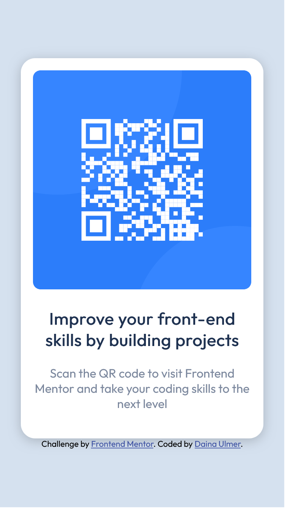

# Frontend Mentor - QR code component solution

This is a solution to the [QR code component challenge on Frontend Mentor](https://www.frontendmentor.io/challenges/qr-code-component-iux_sIO_H). Frontend Mentor challenges help you improve your coding skills by building realistic projects. 

## Table of contents

- [Overview](#overview)
  - [Screenshot](#screenshot)
  - [Links](#links)
- [My process](#my-process)
  - [Built with](#built-with)
  - [What I learned](#what-i-learned)
  - [Continued development](#continued-development)
  - [Useful resources](#useful-resources)
- [Author](#author)
- [Acknowledgments](#acknowledgments)

## Overview
### Screenshot



### Links

- Solution URL: [Frontend Mentor](https://your-solution-url.com)

## My process

### Built with

- Semantic HTML5 markup
- CSS custom properties
- CSS Grid

### What I learned

I kept getting a little confused using flexbox but I used it and it turned out great.
I also learned that you can export the font-family in CSS. Using the universal selector (*) made it easier for me to keep everything in a box. Before, I did not know that. I would try to fix the width, padding and height of every class selector but I would run into a lot of problems doing so. I also, couldn't tell it there was a box-shodow but I still added it because it makes the card standout. 


```html
<div class="card">
      
    <h3 class="heading">
        Improve your front-end skills by building projects
    </h3>
      <p>Scan the QR code to visit Frontend Mentor and take your coding skills to the next level</p>
    </div>
```
```css
* {
    margin: 0;
    box-sizing: border-box;
}

body {
    background-color: #d5e1ef;
    display: flex;
    flex-direction: column;
    justify-content: center;
    align-items: center;
    min-height: 100vh;
    font-family: 'Outfit', sans-serif;
}

.card {
    background-color: white;
	border-radius: 19px;
	width: 320px;
	padding: 16px;
    box-shadow: 0px 3px 15px rgba(0, 0, 0, 0.2);
}
```

### Continued development

I want to focus on using flexbox and CSS grid and having a better understanding of it. I also want to learn more on margin and padding because I seem to get confused when using it. 
To use this QR code as a template for future ideas for growing businesses. 

### Useful resources

- [Example resource 1](https://flexboxfroggy.com/) - This helped me understand a little more about Flexbox after I was stuck for hours doing the wrong thing.
- [Example resource 2](https://www.youtube.com/watch?v=WlGQdgy-M6w) - This YouTuber helped me understand the univseral selector and box-sizing: border-box.

## Author

- Linkedin - [Daina Ulmer](https://www.linkedin.com/in/daina-ulmer-0777a5185/)
- Frontend Mentor - [@DainaU](https://www.frontendmentor.io/profile/DainaU)
- Twitter - [@Daina_Ulmer](https://twitter.com/Daina_Ulmer)

## Acknowledgments

My tip would be to...
- Take you time to the think things through when it's getting confusing or fusrating.
- Ask friends or family for help (If they know how to code)
- Watch other Web Deveployers on YouTube. They might have made a video on a problem your stuck on.
- listen to music to focus.
- Get up, walk around and move your body when sitting for too long.
- **most important** Don't give up!! 
It might be hard now but the more you do it. The better it will get. Remember to have fun coding!
